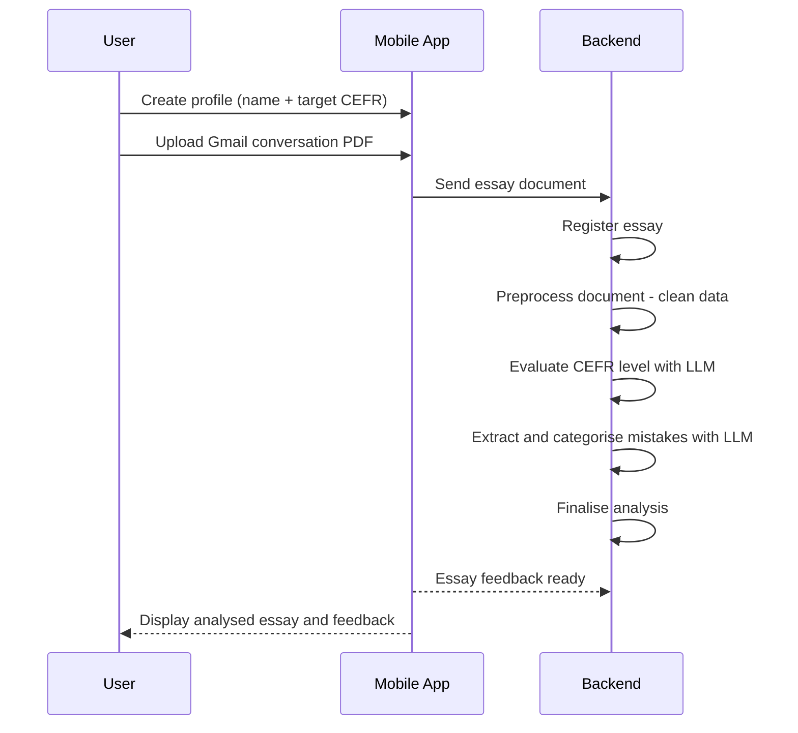

# Pismo

Hello! I have created this project to help myself with leveling up my language skills, but also to show my knowledge in development. I chose to build an app that will help me track my progress in writing skill of Dutch and Russian. These are the two lanuages that I am currently learning, but I chose to start with Russian, because I have failed 4 times the official exam and it was only on the writing part. I perfectly passed speaking, reading, grammer, but writing is my kryptonite, or so it seems.

Pismo is a Serbian word for a letter.

## Problem statement

After years of learning Dutch and Russian, I struggle with writing, not in expressing myself, but in stopping the same mistakes from repeating endlessly. This fine-tuning costs me quite a lot, trapping me in a vicious cycle of failed exams and unbroken errors. More writing practice, self-checks, and time haven't broken it.

## Product Overview

Pismo intends to allow the user (me) to share or upload a pdf document that is an export of gmail exchange with my professor after she corrected my essay. It also allows me to see all my essays and to see each essay individually, with the full analysis.

This is still MVP stage and further developments will be made. Concessions were made to enable the user to analyse the essays that have been checked by professor.

### Simple Product Flow

The user can create a profile by simply providing their name and target CEFR level. After that, the user can upload a PDF document containing an exported Gmail conversation and share it with the app.

Once the document is uploaded, the app first registers the file and separates the original conversation content from any irrelevant or additional text. In the second step, the system analyses the extracted text and evaluates it using LLM models to determine the CEFR level of the essay.

The third step is to identify all mistakes in the essay. These mistakes are extracted, categorised, and explained so the user can understand why each one is incorrect.

Once this process is complete, the essay is fully analysed and presented to the user for review.



### Backlog

#### 

## Tech

Monorepo with a Python/FastAPI backend and a React Native (Expo) mobile app.

## Prerequisites (macOS)

- [Docker](https://www.docker.com/products/docker-desktop/)
- [Ollama](https://ollama.com/) installed natively on your machine (optional if you decide to use external service)
- [Node.js](https://nodejs.org/) (for the mobile app)
- [Xcode](https://developer.apple.com/xcode/) (for iOS simulator)

## Getting Started (macOS)

### 1. Backend + Database

Start the database and backend with Docker:

```bash
docker compose up
```

### 2. Ollama (LLM)

Ollama runs natively on the host machine rather than in Docker. Running it natively is significantly faster because it can use the GPU directly — dockerising it adds overhead and makes the model much slower (CPU-only on macOS).

In production, a hosted API service (e.g. Mistral, Qwen via Groq, or similar) would be used instead.

Install and start Ollama:

```bash
brew install ollama
ollama serve
```

Pull the required model (in production llama-3.3-70b will be used):

```bash
ollama pull qwen3:1.7b
```

### 3. Mobile App

From the `mobile/` directory:

```bash
npm install
npx expo start
```

Press `i` to open in the iOS simulator (requires Xcode and the iOS simulator to be installed).
