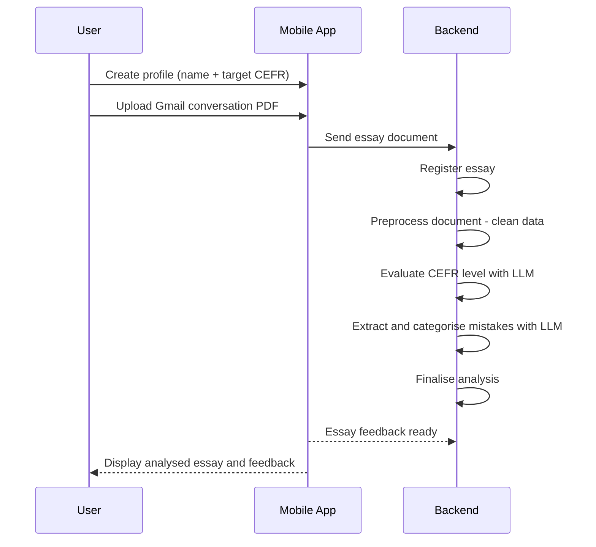

# Pismo

Hello! I have created this project to help myself with leveling up my languages skills, but also to show my knowledge in development. I chose to build an app that will help me track my progress in writing skill of Dutch and Russian. These are the two languages that I am currently learning, but I chose to start with Russian, because I have failed 4 times the official exam and it was only on the writing part. I passed speaking, reading, and grammar with strong results, but repeatedly failed the writing section. Writing became my kryptonite.

Pismo is a Serbian word for a letter.

## Problem statement

After years of studying Dutch and Russian, I realised my main problem was not expressing ideas, but repeatedly making the same mistakes in writing.

Even after receiving corrections from my professor, those mistakes kept reappearing in essays. The feedback was useful, but there was no system that helped me track patterns across multiple essays.

Pismo was built to solve that.

## Product Overview

Pismo intends to allow the user (me) to share or upload a pdf document that is an export of gmail exchange with my professor after she corrected my essay. It also allows me to see all my essays and to see each essay individually, with the full analysis.

This is still MVP stage and further developments will be made. Concessions were made to enable the user to analyse the essays that have been checked by professor.


## Key Features

- Upload corrected essays from Gmail conversations
- Automatic extraction of the original essay text
- LLM-powered CEFR level evaluation
- Automatic mistake detection and categorisation
- Explanation of each mistake
- Historical view of all essays and corrections

### Simple Product Flow

The user can create a profile by simply providing their name and target CEFR level. After that, the user can upload a PDF document containing an exported Gmail conversation and share it with the app.

Once the document is uploaded, the app first registers the file and separates the original conversation content from any irrelevant or additional text. In the second step, the system analyses the extracted text and evaluates it using LLM models to determine the CEFR level of the essay.

The third step is to identify all mistakes in the essay. These mistakes are extracted, categorised, and explained so the user can understand why each one is incorrect.

Once this process is complete, the essay is fully analysed and presented to the user for review.



## Roadmap

Pismo is still in MVP stage, but here’s what I plan to add in the future to make it more helpful to the user:

### 1. Security & User Management
- Add **JWT token authentication** so my account and essays are safe and private. Now I use only uuids to seperate the users.

### 2. Multilingual Support
- Allow the same kind of analysis for **Dutch**, not just Russian. That way I can track progress in both languages.

### 3. Write Essays Directly in the App
- Let the user (me) **write an essay inside the app** instead of only uploading PDFs.
- Convert what I type from **QWERTY to Russian letters** automatically (like [Translit.net](https://translit.net/)).
- Analyse the essay fully using **LLM**, without needing a teacher in the loop.

### 4. Historical Insights
- Show an **overview of the past 5 essays** for each language.
- Highlight the **most common mistakes** so I know where I usually go wrong.

### 5. Personalized Recommendations
- Give **tips for the next essay** based on my previous mistakes.
- Suggest **ways to improve my weakest points**, for example with flashcards or targeted exercises.

This roadmap shows what I want to improve for myself, but also reflects the way I think about building a product: step by step, focusing on what brings the most value to the user first.

## Architecture

Pismo is structured as a monorepo containing:

- **Backend:** Python + FastAPI
- **Mobile app:** React Native (Expo)
- **LLM inference:** Ollama (local models during development)
- **Database:** PostgreSQL (Docker)

The backend is responsible for:

- file ingestion
- text preprocessing
- LLM evaluation
- mistake extraction
- storing essay analysis


## Prerequisites (macOS)

- [Docker](https://www.docker.com/products/docker-desktop/)
- [Ollama](https://ollama.com/) installed natively on your machine (optional if you decide to use external service)
- [Node.js](https://nodejs.org/) (for the mobile app)
- [Xcode](https://developer.apple.com/xcode/) (for iOS simulator)

## Getting Started (macOS)

### 1. Backend + Database

Start the database and backend with Docker:

```bash
docker compose up
```

### 2. Ollama (LLM)

Ollama runs natively on the host machine rather than in Docker. Running it natively is significantly faster because it can use the GPU directly — dockerising it adds overhead and makes the model much slower (CPU-only on macOS).

In production, a hosted API service (e.g. Mistral, Qwen via Groq, or similar) would be used instead.

Install and start Ollama:

```bash
brew install ollama
ollama serve
```

Pull the required model (in production llama-3.3-70b will be used):

```bash
ollama pull qwen3:1.7b
```

### 3. Mobile App

From the `mobile/` directory:

```bash
npm install
npx expo start
```

Press `i` to open in the iOS simulator (requires Xcode and the iOS simulator to be installed).
